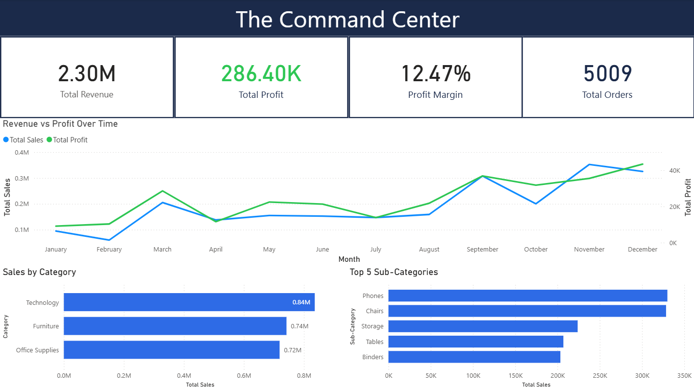
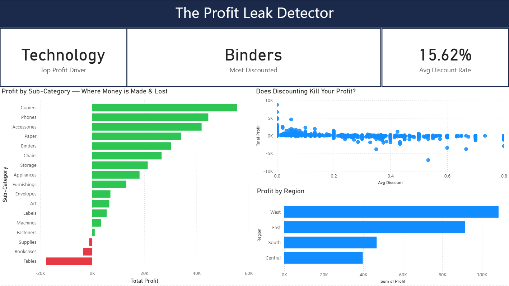
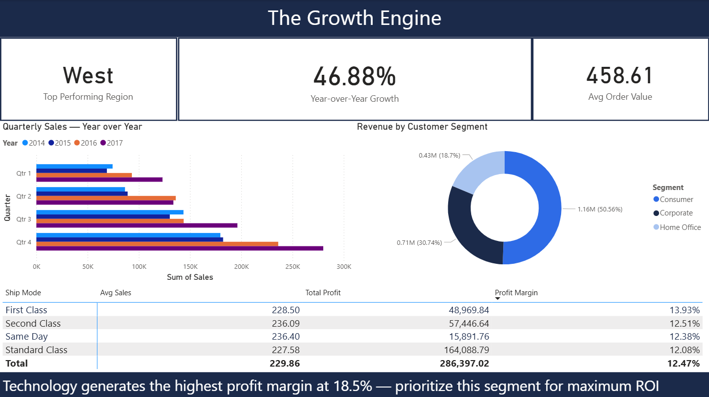
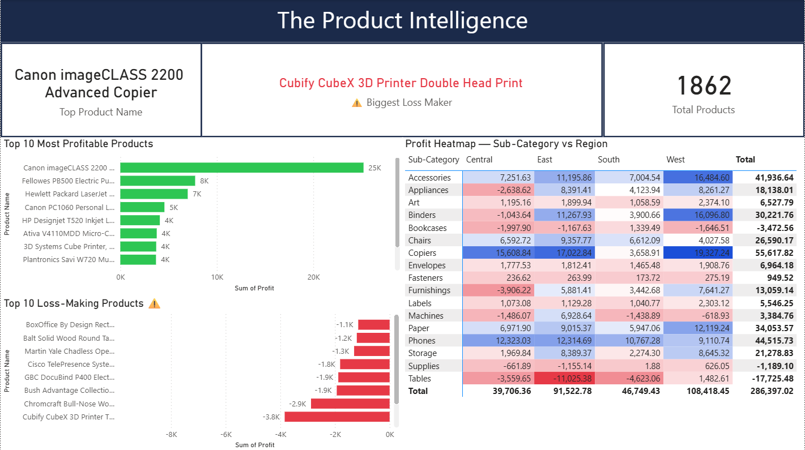

# 🔍 ProfitLens — Power BI Profit Diagnosis Dashboard

> Stop guessing. See exactly where your business loses money.

---

## 📊 Overview

ProfitLens is a 4-page Power BI dashboard built to help business 
owners and analysts diagnose profit performance — not just track 
revenue. It goes beyond standard sales reports to reveal where 
money is being lost and why.

Built using the classic Superstore Sales dataset.

---

## 📄 Pages

| Page | Name | Purpose |
|------|------|---------|
| 1 | **The Command Center** | KPIs, revenue vs profit over time, top categories |
| 2 | **The Profit Leak Detector** | Sub-category losses, discount impact, regional profit |
| 3 | **The Growth Engine** | YoY growth, customer segments, shipping performance |
| 4 | **The Product Intelligence** | Best/worst products, profit heatmap by region |

---

## 🖼️ Screenshots

### Page 1 — The Command Center

### Page 2 — The Profit Leak Detector

### Page 3 — The Growth Engine

### Page 4 — The Product Intelligence

---

## 🛠️ Built With

- Microsoft Power BI Desktop
- DAX (Data Analysis Expressions)
- Superstore Sales Dataset (Kaggle)

---

## 📁 Dataset

The dataset used is the publicly available 
[Superstore Sales Dataset](https://www.kaggle.com/datasets/vivek468/superstore-dataset-final) 
from Kaggle.

---

## 📬 Custom Dashboard for Your Business?

This template will be available as a custom service on Fiverr.
I'll adapt it to your own data and business context.

---

## 📬 Want This Dashboard?

This is a premium template delivered as a ready-to-use `.pbix` 
file, adapted to your own business data.

👉 [Let's connect on LinkedIn](linkedin.com/in/omar-y-awad)
